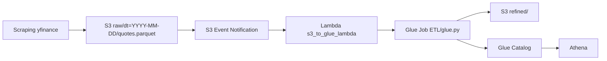

# Arquitetura e Fluxo

Este documento resume a arquitetura do projeto e o fluxo ponta a ponta para a entrega do Tech Challenge Fase 2.

## Visao geral

O projeto implementa um pipeline batch para dados diarios da B3 com as seguintes camadas:

- `scraping`: extracao e carga da camada bruta em `raw/`
- `orchestration`: disparo do Glue Job via evento S3 e Lambda
- `ETL`: transformacao e gravacao da camada refinada em `refined/`
- `Glue Catalog`: catalogacao automatica da tabela refinada
- `Athena`: consulta SQL da camada refinada

## Diagrama da arquitetura

## Fluxo detalhado

### 1. Ingestao bruta

O script [extract_b3_to_s3.py](/home/capizani/FIAP/Tech-Challenge-2/scraping/extract_b3_to_s3.py) baixa cotacoes diarias de ativos da B3 via `yfinance` e grava em:

- `s3://<bucket>/raw/dt=YYYY-MM-DD/quotes.parquet`

Caracteristicas:

- granularidade diaria
- formato parquet
- particao por data
- retries em caso de falha

### 2. Disparo automatico

Quando um novo objeto entra em `raw/`, o bucket publica um evento S3.

O arquivo [s3_to_glue_lambda.py](/home/capizani/FIAP/Tech-Challenge-2/orchestration/s3_to_glue_lambda.py) faz:

- validacao do path recebido
- montagem dos argumentos do Glue Job
- chamada `glue.start_job_run(...)`

Argumentos principais enviados:

- `--S3_ROOT`
- `--INPUT_S3_URI`
- `--LOOKBACK_DAYS`
- `--CATALOG_DATABASE`
- `--CATALOG_TABLE`

### 3. Transformacao no Glue

O job [glue.py](/home/capizani/FIAP/Tech-Challenge-2/ETL/glue.py) le o arquivo do dia em `raw/`, consulta o historico da camada `raw` para a janela configurada e aplica as transformacoes obrigatorias do desafio:

- requisito A: agregacao diaria por ticker
- requisito B: renomeacao de colunas `open -> opening_price` e `close -> closing_price`
- requisito C: calculo temporal com `prev_close`, `daily_return_pct` e `ma7_close`

Saida:

- `s3://<bucket>/refined/`

Particoes:

- `dt`
- `ticker`
- `dataset`

Datasets gravados:

- `quotes`
- `daily_agg`

### 4. Catalogacao automatica

Na escrita final, o Glue Job atualiza o Glue Catalog automaticamente usando:

- `enableUpdateCatalog=True`
- `setCatalogInfo(...)`

Defaults atuais:

- database: `default`
- table: `b3_refined`

### 5. Consulta no Athena

Com a tabela catalogada, o Athena consulta a camada refinada por SQL. As queries sugeridas estao em:

- [athena_queries.md](/home/capizani/FIAP/Tech-Challenge-2/docs/athena_queries.md)

## Como apresentar no video

Sequencia sugerida para uma demonstracao curta:

1. mostrar a arquitetura em alto nivel
2. mostrar um arquivo em `raw/dt=.../quotes.parquet`
3. mostrar a Lambda sendo disparada
4. mostrar o Glue Job executando
5. mostrar a tabela no Glue Catalog
6. rodar uma query no Athena

## Mapeamento com os requisitos do desafio

- Requisito 1: scraping diario da B3
- Requisito 2: `raw/` em parquet com particao diaria
- Requisito 3: S3 aciona Lambda e Lambda chama Glue
- Requisito 4: Lambda em Python apenas para disparo do Glue
- Requisito 5: ETL com agregacao, renomeacao e calculo temporal
- Requisito 6: `refined/` em parquet particionado
- Requisito 7: atualizacao automatica do Glue Catalog
- Requisito 8: consulta via Athena
